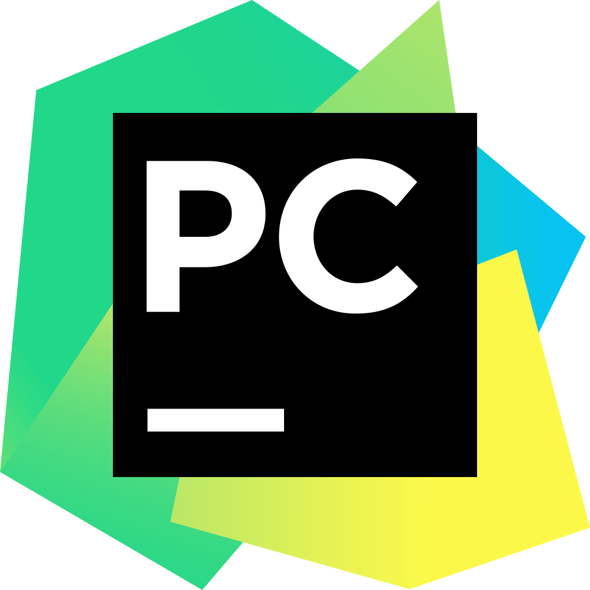
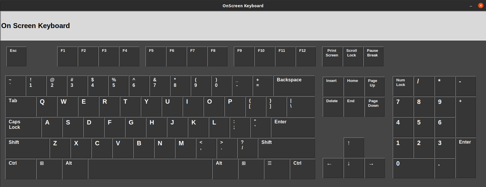
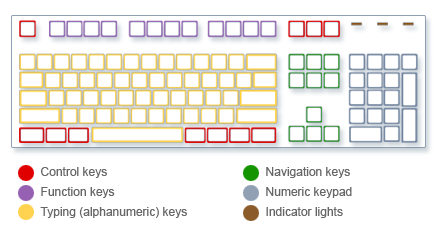

# On-Screen Keyboard - Python
A gui version of on-screen keyboard using python tkinter.
 

### Languages & tools :
[][vscode]
[][python]
[][python]
  

 

### Directory Structure :
    |-- folder
    |   |-- main.py
    |   |-- onScreenNumPad.py
    |
    |-- main.py
    |
    |-- Img
    |   |-- pycharm.png
    |   |-- python.png
    |   |-- keyboard.jpg
    |   |-- vscode.png
    |
    |-- README.md

### Typing (alphanumeric) keys. 
    These keys include the same letter, number, punctuation, and symbol keys found on a traditional typewriter.

### Control keys. 
    These keys are used alone or in combination with other keys to perform certain actions. The most frequently used control keys are Ctrl, Alt, the Windows logo key Picture of the Windows logo key, and Esc.

### Function keys. 
    The function keys are used to perform specific tasks. They are labeled as F1, F2, F3, and so on, up to F12. The functionality of these keys differs from program to program.

### Navigation keys. 
    These keys are used for moving around in documents or webpages and editing text. They include the arrow keys, Home, End, Page Up, Page Down, Delete, and Insert.

### Numeric keypad. 
    The numeric keypad is handy for entering numbers quickly. The keys are grouped together in a block like a conventional calculator or adding machine.

The following illustration shows how these keys are arranged on a typical keyboard. Your keyboard layout might be different.

  

## Connect with me:  

  
 

[website]: https://abhilashtuofficial.github.io/
[vscode]: https://code.visualstudio.com/
[python]: https://github.com/AbhilashTUofficial/Python-programming
